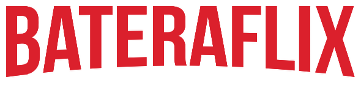

<p align="center">
      
  
  <a href="https://github.com/mikansc/bateraflix/commits/master">
    
  </a>
  <a href="https://bateraflix.vercel.app">
    
  </a>
   
</p>
<h1 align="center">
    
</h1>
<p align="center">
Bateraflix é um projeto da #ImersãoReact Alura
</p>
<p align="center">

  </p>
<p align="center">
 <a href="#-sobre-o-projeto">Sobre</a> •
 <a href="#-funcionalidades">Funcionalidades</a> •
 <a href="#-layout">Layout</a> • 
 <a href="#-como-executar-o-projeto">Como executar</a> • 
 <a href="#-tecnologias">Tecnologias</a> • 
 <a href="#-autor">Autor</a> • 
 <a href="#user-content--licença">Licença</a>
</p>

---

<p style="margin-top: 20px">

## ☕ Sobre o projeto

Bateraflix - é um projeto baseado no Netflix com conteúdo voltado para músicos bateristas.

O projeto foi desenvolvido durante a **Semana React da** [](http://www.alura.com.br) e personalizado por **Michael** **Nascimento**.

A ideia do projeto é oferecer uma plataforma de acesso à conteúdo de estúdo e entretenimento totalmente voltada para o instrumento, dentro de uma interface amigável e já conhecida.

### [Clique aqui para acessar a demonstração](https://bateraflix.vercel.app)

---

<p style="margin-top: 20px">

## ⚙ Funcionalidades

- <p style="display: inline; margin-right: 10px;"></p>O usuário pode cadastrar um vídeo do YouTube:

  - <p style="display: inline; margin-right: 10px;">👉</p> Acessar "Novo vídeo"
  - <p style="display: inline; margin-right: 10px;">👉</p> Inserir título do vídeo, link e categoria
  - <p style="display: inline; margin-right: 10px;">👉</p> A categoria é sugerida pelo próprio aplicativo
  - <p style="display: inline; margin-right: 10px;">👉</p> Clicar em cadastrar

- <p style="display: inline; margin-right: 10px;"></p>O usuário pode cadastrar uma categoria de vídeo

  - <p style="display: inline; margin-right: 10px;">👉</p> Acessar "Novo vídeo"
  - <p style="display: inline; margin-right: 10px;">👉</p> Acessar "Cadastrar categoria"
  - <p style="display: inline; margin-right: 10px;">👉</p> Inserir o nome da categoria, descrição e cor da etiqueta

---

<p style="margin-top: 20px">

## 🎨 Layout

O desenho do layout foi pensado mobile-first.

<h2 align="center"> Mobile 📱 </h2>
<p align="center" style="display: block;">
  
</p>
<p style="margin-top: 20px">
<h2 align="center"> Web 🖥 </h2>
<p style="margin-top: 20px">
<p align="center" style="display: block; width: 100%">
  
</p>

---

<p style="margin-top: 20px">

## 🔌 Como executar o projeto

Este projeto é composto por um servidor simples (JSON Server) e React no front-end.

####

<p style="margin-top: 20px">

```bash

# Clonar o repositório
$ git clone https://github.com/mikansc/bateraflix.git

# Acessar a pasta do projeto
$ cd bateraflix

# Instalar as dependências
$ npm install

# Executar a aplicação em modo de desenvolvimento
$ npm run dev

# O aplicativo inciará na porta:3000 - acesse http://localhost:3000
# O JSON Server executa automaticamente com a aplicação.

```

---

<p style="margin-top: 20px">

## 🛠 Tecnologias

As seguintes ferramentas foram usadas na construção do projeto:

#### **Front-end**

- **[React Router](https://github.com/ReactTraining/react-router/tree/master/packages/react-router-dom)**
- **[Styled Components](https://styled-components.com/)**
- **[React Slick](https://react-slick.neostack.com/)**

#### **Server**

- **[JSON Server](https://github.com/typicode/json-server)**

> Veja o arquivo [package.json](https://github.com/mikansc/bateraflix/blob/master/package.json)

<p style="margin-top: 20px">

---

<p style="margin-top: 20px">

## ✋ Autor

<a href="http://www.mkwebdev.com.br/">
 
 <br />
 <sub><b>Michael Nascimento</b></sub></a> <a href="http://www.mkwebdev.com.br/" title="Rocketseat"></a>
 <br />

[](https://www.linkedin.com/in/michaelnsc/)
[](mailto:michael.nsc@outlook.com)

---

<p style="margin-top: 20px">

## 📝 Licença

Este projeto esta sobe a licença [MIT](./LICENSE).

---

<p style="margin-top: 20px">

Layout do README baseado no layout feito com ❤️ por Thiago Marinho 👋🏽 [Entre em contato!](https://www.linkedin.com/in/tgmarinho/)
